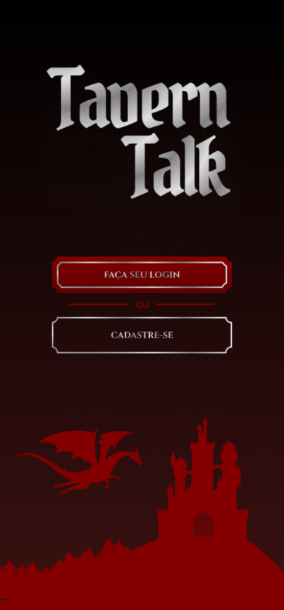
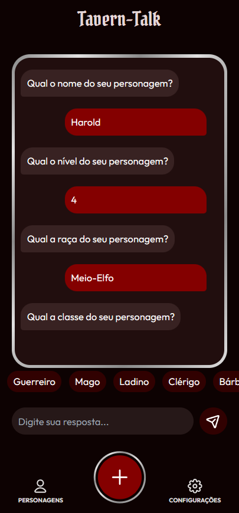
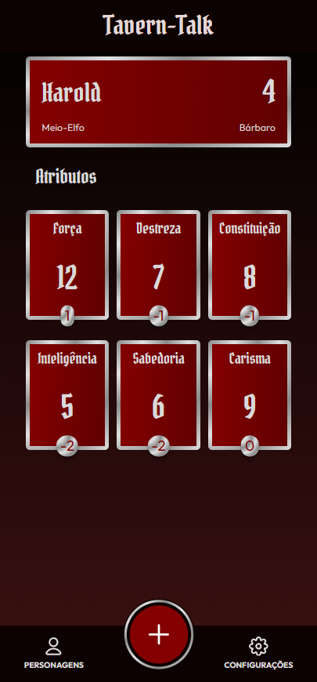

# TAVERN TALK
Crie personagens de D&D como uma conversa amigável!\
Feito com Next.js e MongoDB
 |  | 
|-|-|-|
### Funções atuais:
- Criação e login de usuário
- Criação de personagens com interface de chat
- Listagem de personagens do usuário
- Visualizção de personagem (com cálculo de modificadores)
### Funções planejadas
- Melhoria do sistema de autenticação
- Mais detalhes do personagem
- Possibilidade de maior customização
- Exportação de ficha em PDF

### MVP:
Acesse uma demonstração do app aqui:
https://tavern-talk.vercel.app/